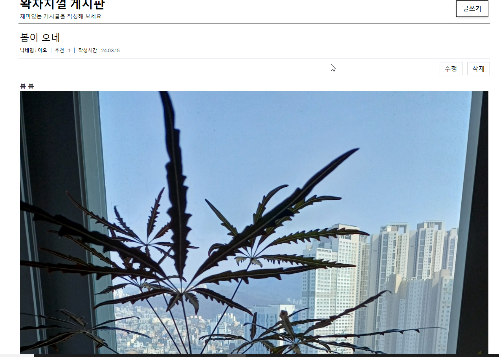
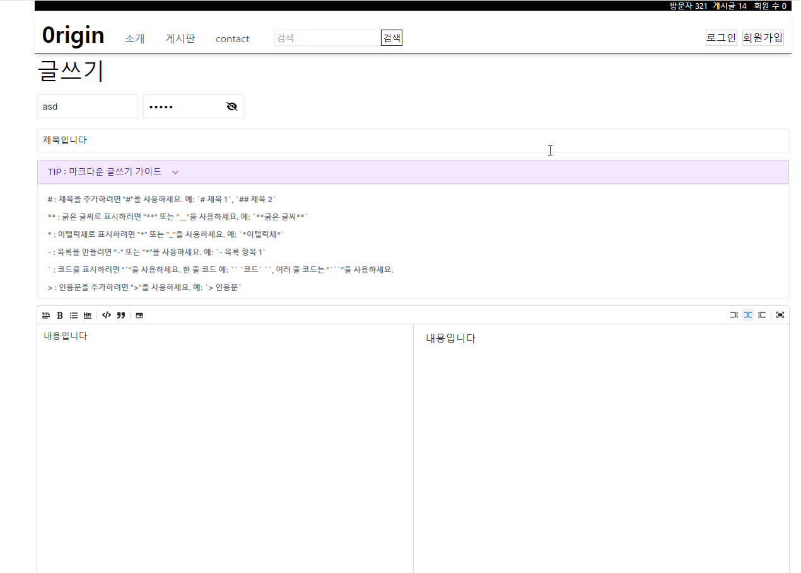

# 0rigin Community Web Page v1.0
철학 기반 커뮤니티 게시판
# 개발 인원
1인 개발
## 배포 주소
[https://0rigin.vercel.app/](https://0rigin.vercel.app/)
## 프로젝트 소개

0rigin project는 AI가 대체할 수 없는 인간의 고유한 가치를 토론하는 커뮤니티 입니다.

## 프로젝트 구성
환경 : next.js
디자인 패턴 : FSD( Feature Sliced Design )
핵심 라이브러리 : react-markdown 
css : tailwindcv
## 기능별 페이지

### 홈 페이지


### 게시판

페이지 네이션 처리
마크다운 에디터를 사용한 글쓰기 에디터





### 로그인

firebase auth


### 회원 가입

firebase auth


### 퀴즈

퀴즈 풀이
퀴즈 프로그레스 바
정답 확인

## 시작 가이드

### Requirements

응용 프로그램을 빌드하고 실행하는 데 필요한 사항:

업데이트 중

-  node: 20.8.1
-  pnpm: 8.6.2
-  react: 18.3.1
-  next: 14.2.4

응용 프로그램을 정상적으로 실행하기 위해서는 다음 키가 필요합니다:

-  Firebase Key: Firebase 프로젝트를 생성 후, 프로젝트 설정에서 제공되는 Web API 키입니다.
-  NextAuth Secret Key: 안전한 사용자 인증을 위해 NextAuth.js에 필요한 비밀 키입니다. 고유하고 복잡한 문자열을 생성하여 사용하세요.
-  OpenAI API Key: OpenAI 서비스를 사용하기 위해 필요한 API 키입니다. OpenAI 계정을 생성하고 API 키를 발급받으세요.

## 환경 변수 설정

프로젝트의 보안과 구성을 위해 다음 환경 변수를 `.env.local` 파일에 설정해야 합니다. 이 파일은 프로젝트의 루트 디렉토리에 위치해야 합니다.

### Next.js 환경 변수

```env
API_URL=
NEXTAUTH_URL_INTERNAL=
NEXTAUTH_SECRET=
```

### firebase 환경변수

FIREBASE_API_KEY=
FIREBASE_AUTH_DOMAIN=
FIREBASE_PROJECT_ID=
FIREBASE_STORAGE_BUCKET=
FIREBASE_MESSAGING_SENDER_ID=
FIREBASE_APP_ID=

### openai 설정

OPENAI_API_KEY=

### Installation

```bash
$ git clone https://github.com/gitjoyoung/0rigin-next-project.git
$ pnpm install
$ pnpm run dev
```
