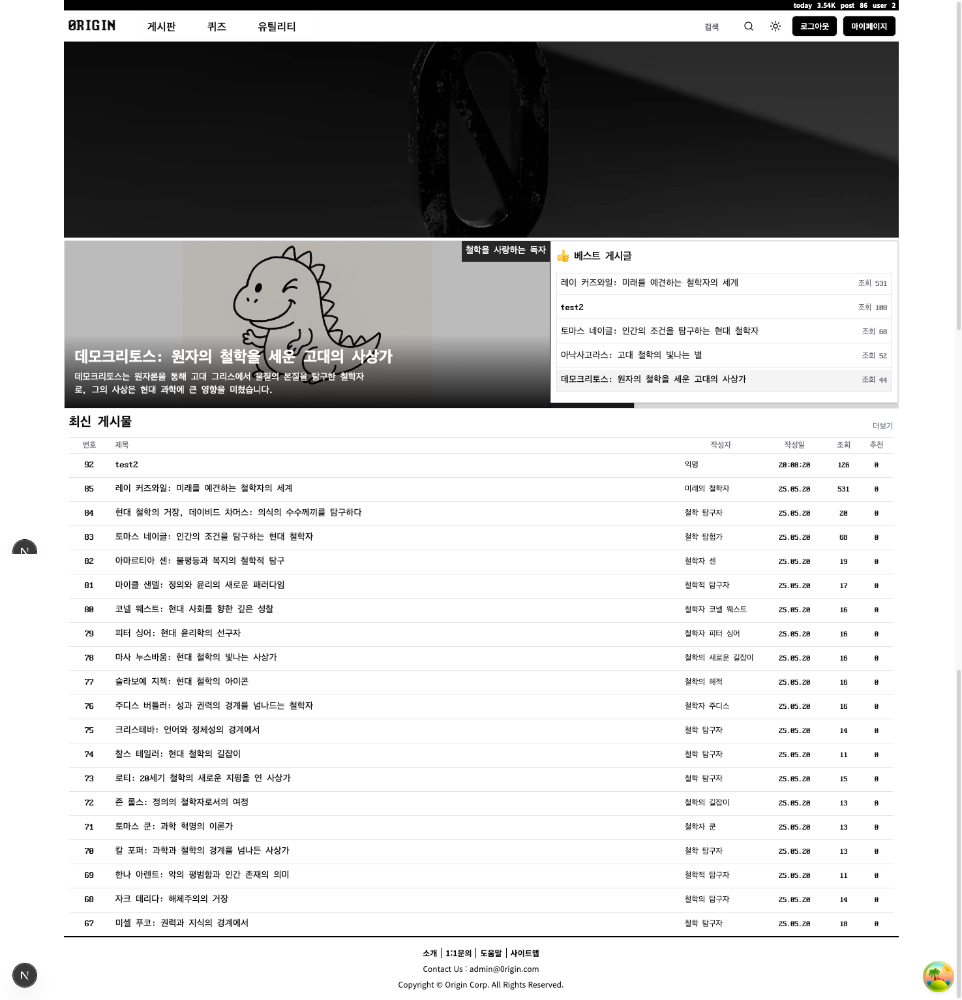
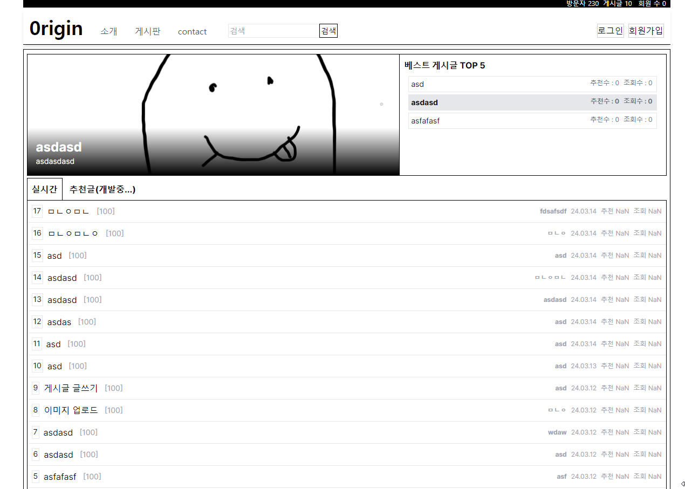

# 0rigin Community Web Page v1.0

철학 기반 게시판 웹 사이트

1인 개발

## 개발 기간

2022.01 ~ 2024.03

## 배포 주소

[https://0rigin-next-project-ten.vercel.app/](https://0rigin-next-project-ten.vercel.app/)

## 프로젝트 소개

0rigin project는 AI가 대체할 수 없는 인간의 고유한 가치를 토론하는 커뮤니티입니다!


## 기능별 페이지

### main

### login

### sign up


## 시작 가이드

### Requirements

응용 프로그램을 빌드하고 실행하는 데 필요한 사항:

-  node: 20.8.1
-  pnpm: 8.6.2
-  react: 18.2.0
-  next: 14.1.0

응용 프로그램을 정상적으로 실행하기 위해서는 다음 키가 필요합니다:

-  Firebase Key: Firebase 프로젝트를 생성 후, 프로젝트 설정에서 제공되는 Web API 키입니다.
-  NextAuth Secret Key: 안전한 사용자 인증을 위해 NextAuth.js에 필요한 비밀 키입니다. 고유하고 복잡한 문자열을 생성하여 사용하세요.
-  OpenAI API Key: OpenAI 서비스를 사용하기 위해 필요한 API 키입니다. OpenAI 계정을 생성하고 API 키를 발급받으세요.

## 환경 변수 설정

프로젝트의 보안과 구성을 위해 다음 환경 변수를 `.env.local` 파일에 설정해야 합니다. 이 파일은 프로젝트의 루트 디렉토리에 위치해야 합니다.

### Next.js 환경 변수

```env
NEXT_PUBLIC_API_URL=
NEXTAUTH_URL_INTERNAL=
NEXTAUTH_SECRET=
```

### firebase 환경변수

NEXT_PUBLIC_FIREBASE_API_KEY=
NEXT_PUBLIC_FIREBASE_AUTH_DOMAIN=
NEXT_PUBLIC_FIREBASE_PROJECT_ID=
NEXT_PUBLIC_FIREBASE_STORAGE_BUCKET=
NEXT_PUBLIC_FIREBASE_MESSAGING_SENDER_ID=
NEXT_PUBLIC_FIREBASE_APP_ID=

### openai 설정

NEXT_PUBLIC_OPENAI_API_KEY=

### Installation

```bash
$ git clone https://github.com/gitjoyoung/0rigin-next-project.git
$ pnpm install
$ pnpm run dev
```
