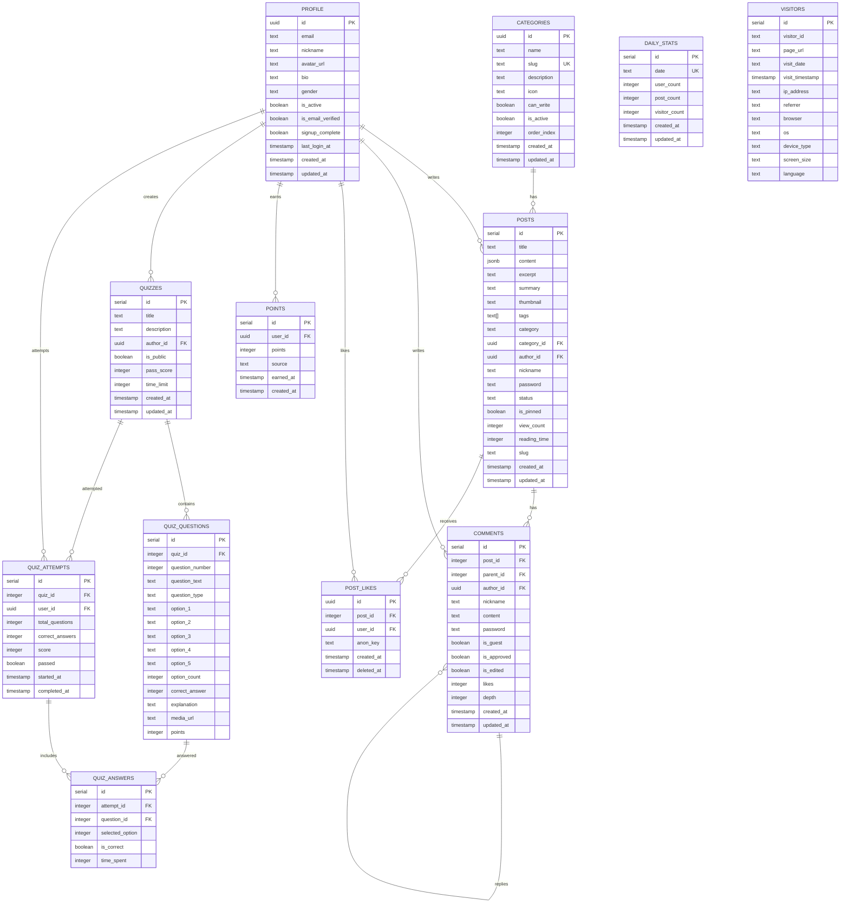

# Supabase 데이터베이스 관리 문서

## 📋 **개요**

이 문서는 0rigin-next-project의 Supabase 데이터베이스 구조, 마이그레이션 관리, 그리고 자주 사용하는 CLI 명령어들을 설명합니다.

## 🏗️ **데이터베이스 구조**

### 데이터베이스 ERD



## 📊 **테이블별 상세 설명**

### 🏷️ **Core Tables (핵심 테이블)**

#### **categories** - 게시판 카테고리

```sql
-- 게시판 카테고리 관리
- 자유게시판, 질문과답변, 개발, 공지사항 등
- slug를 통한 URL 라우팅
- 카테고리별 쓰기 권한 제어 (can_write)
```

#### **profile** - 사용자 프로필

```sql
-- 사용자 기본 정보 관리
- 이메일, 닉네임, 아바타 등
- 가입 완료 여부 (signup_complete)
- 이메일 인증 여부 (is_email_verified)
```

#### **posts** - 게시글

```sql
-- 게시글 관리
- JSONB 형태의 콘텐츠 저장
- 태그 배열 지원
- 조회수, 읽기 시간 등 메타데이터
- 비밀번호 게시글 지원
```

#### **comments** - 댓글

```sql
-- 댓글 및 대댓글 관리
- 계층형 댓글 구조 (parent_id, depth)
- 게스트 댓글 지원
- 좋아요 기능
```

### 🎯 **Feature Tables (기능 테이블)**

#### **post_likes** - 게시글 좋아요

```sql
-- 게시글 좋아요 관리
- 사용자 및 익명 좋아요 지원
- 소프트 삭제 (deleted_at)
```

#### **points** - 포인트 시스템

```sql
-- 사용자 포인트 관리
- 가입 보너스, 게시글 작성 등 다양한 소스
- 포인트 획득 이력 추적
```

#### **퀴즈 시스템 (quizzes, quiz_questions, quiz_attempts, quiz_answers)**

```sql
-- 퀴즈 기능 관리
- 객관식 문제 지원 (2~5개 선택지)
- 퀴즈 시도 기록 및 채점
- 합격 기준 점수 설정
```

### 📈 **Analytics Tables (분석 테이블)**

#### **daily_stats** - 일일 통계

```sql
-- 일일 통계 데이터
- 사용자 수, 게시글 수, 방문자 수
- 날짜별 트렌드 분석
```

#### **visitors** - 방문자 로그

```sql
-- 방문자 행동 분석
- 디바이스 정보, 브라우저 정보
- 페이지별 방문 기록
```

## 🔧 **마이그레이션 파일**

### 📁 **파일 구조**

```
supabase/
├── migrations/
│   ├── 20250705145300_initial_schema.sql      # 초기 스키마 생성
│   └── 20250705150000_fix_production_schema.sql # 프로덕션 스키마 수정
├── seed.sql                                   # 개발용 시드 데이터
└── config.toml                               # Supabase 설정
```

### 🚀 **마이그레이션 상세**

#### **20250705145300_initial_schema.sql** (12KB)

- **12개 테이블** 생성
- **16개 인덱스** 생성
- **3개 함수** 생성 (조회수, 방문자, 통계)
- **6개 트리거** 생성 (updated_at 자동 업데이트)
- **기본 카테고리** 데이터 삽입

#### **20250705150000_fix_production_schema.sql** (7KB)

- **프로덕션 환경** 호환성 수정
- **외래키 제약조건** 추가
- **인덱스 중복** 방지
- **멱등성 보장** (안전한 재실행)

## 🌱 **시드 데이터**

### **seed.sql** (96줄)

```sql
-- 개발 환경용 테스트 데이터
- 테스트 사용자: 3명
- 테스트 게시글: 3개
- 테스트 댓글: 3개
- 테스트 퀴즈: 2개 (문제 3개)
- 테스트 포인트: 5개
- 테스트 통계: 5일치
- 테스트 방문자: 4명
```

## 🛠️ **자주 사용하는 CLI 명령어**

### 🔗 **프로젝트 연결**

```bash
# 프로젝트 목록 확인
pnpm supabase projects list

# 프로젝트 연결
pnpm supabase link --project-ref YOUR_PROJECT_REF

# 연결 상태 확인
pnpm supabase status
```

### 🚀 **로컬 개발 환경**

```bash
# 로컬 Supabase 시작
pnpm supabase start

# 로컬 Supabase 중지
pnpm supabase stop

# 로컬 데이터베이스 리셋
pnpm supabase db reset
```

### 📊 **데이터베이스 관리**

```bash
# 마이그레이션 실행
pnpm supabase db push

# 마이그레이션 상태 확인
pnpm supabase migration list

# 새로운 마이그레이션 생성
pnpm supabase migration new [마이그레이션_이름]

# 스키마 차이점 확인
pnpm supabase db diff --use-migra

# 시드 데이터 로드
pnpm supabase db seed
```

### 🔍 **스키마 및 데이터 덤프**

```bash
# 전체 스키마 덤프
pnpm supabase db dump --linked --schema public --data-only=false

# 데이터만 덤프
pnpm supabase db dump --linked --schema public --data-only=true

# 특정 테이블 덤프
pnpm supabase db dump --linked --schema public --include=posts,comments

# 파일로 저장
pnpm supabase db dump --linked --schema public --data-only=false > schema_backup.sql
```

### 🎯 **타입 생성**

```bash
# TypeScript 타입 생성
pnpm supabase gen types typescript --project-id YOUR_PROJECT_ID --schema public > src/shared/types/database.types.ts

# 또는 package.json 스크립트 사용
pnpm run db:types
```

### 🔐 **인증 관리**

```bash
# 로그인
pnpm supabase login

# 로그아웃
pnpm supabase logout

# 액세스 토큰 확인
pnpm supabase projects list
```

## 🎨 **함수 (Database Functions)**

### **increment_view_count(post_id)**

```sql
-- 게시글 조회수 증가
SELECT increment_view_count(1);
```

### **increment_visitor_count(session_id)**

```sql
-- 방문자 수 증가
SELECT increment_visitor_count('visitor_001');
```

### **update_stats()**

```sql
-- 일일 통계 업데이트
SELECT update_stats();
```

## 🔒 **보안 고려사항**

### **Row Level Security (RLS)**

```sql
-- 현재 RLS 정책 없음
-- 프로덕션 환경에서는 다음 RLS 정책 적용 권장:

-- 사용자 프로필 보호
ALTER TABLE profile ENABLE ROW LEVEL SECURITY;

-- 게시글 작성자만 수정 가능
ALTER TABLE posts ENABLE ROW LEVEL SECURITY;

-- 댓글 작성자만 수정 가능
ALTER TABLE comments ENABLE ROW LEVEL SECURITY;
```

### **데이터 검증**

```sql
-- 입력 데이터 검증
- 사용자 입력은 항상 sanitize
- SQL 인젝션 방지
- XSS 공격 방지
```

## 📈 **성능 최적화**

### **인덱스 현황**

```sql
-- 주요 인덱스들
- idx_posts_category_id: 카테고리별 게시글 조회
- idx_posts_created_at: 최신 게시글 조회
- idx_comments_post_id: 게시글별 댓글 조회
- idx_post_likes_post_id: 게시글별 좋아요 조회
- idx_quiz_attempts_user_id: 사용자별 퀴즈 기록
```

### **쿼리 최적화 팁**

```sql
-- 1. 필요한 컬럼만 선택
SELECT id, title, created_at FROM posts;

-- 2. 인덱스 활용
WHERE category_id = 'uuid' AND created_at > '2025-01-01';

-- 3. 조인 최적화
SELECT p.title, c.name
FROM posts p
JOIN categories c ON p.category_id = c.id;
```

## 🚨 **주의사항**

### **마이그레이션 규칙**

- 각 마이그레이션은 **멱등성** 보장
- `CREATE TABLE IF NOT EXISTS` 사용
- 프로덕션 환경에서는 **백업 필수**
- 대용량 테이블 변경 시 **점진적 마이그레이션** 고려

### **데이터 관리**

- 정기적인 **데이터 백업**
- 불필요한 로그 데이터 **정리**
- 개인정보 보호 **컴플라이언스** 준수

## 📚 **참고 자료**

### **공식 문서**

- [Supabase 공식 문서](https://supabase.com/docs)
- [PostgreSQL 공식 문서](https://www.postgresql.org/docs/)
- [Supabase CLI 문서](https://supabase.com/docs/reference/cli)

### **프로젝트 파일**

- `../src/shared/types/database.types.ts` - TypeScript 타입 정의
- `../package.json` - 프로젝트 스크립트 및 의존성
- `.env.local` - 환경변수 설정

---

> 📝 **마지막 업데이트**: 2025-07-05  
> 🔧 **관리자**: 0rigin-next-project Team  
> 📧 **문의**: 프로젝트 관리자에게 연락
